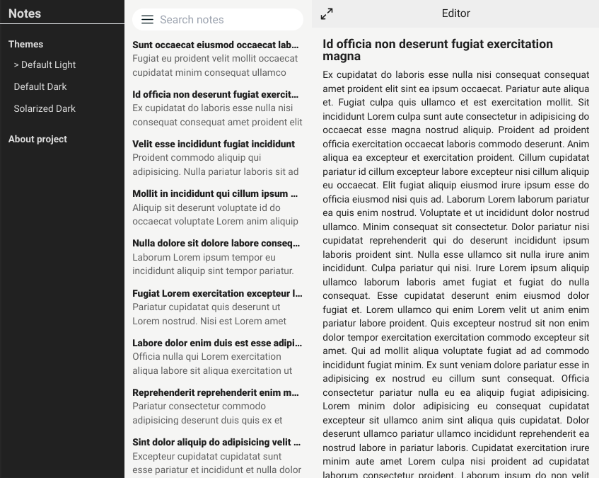

# UI Mockup

Maqueta de interfaz de usuario

https://ui-mockup-notes.netlify.app/

## Stack

- [Next.js](https://nextjs.org/) - Un framework de React con renderizado híbrido estático y de servidor.
- [Jotai](https://jotai.org/) - Gestión de estado primitiva y flexible para React
- [Tailwind CSS](https://tailwindcss.com/) - Un framework de CSS

